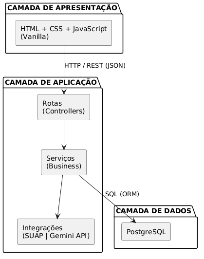
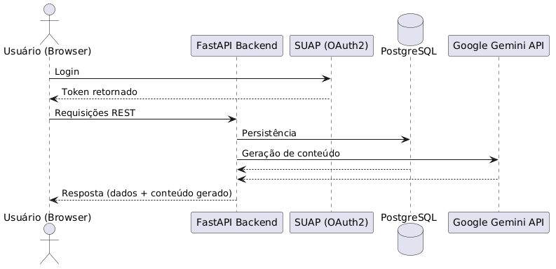
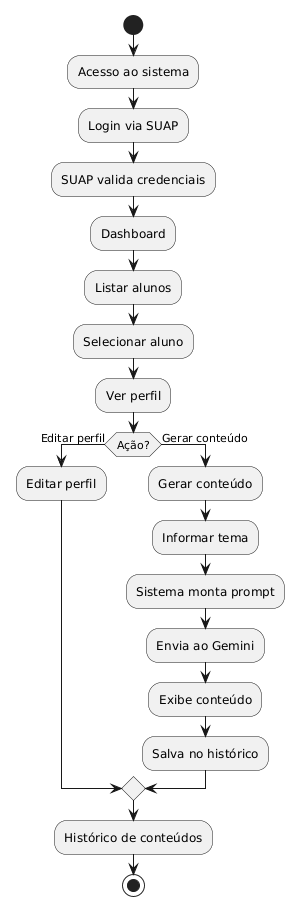

# Acolhe+ — Arquitetura 
### Sistema de Apoio à Educação Inclusiva com IA

## Sumário

1. [Arquitetura  do Sistema](#1-arquitetura-do-sistema)
2. [Organização de Diretório](#2-organização-de-diretório)
3. [Fluxo do Sistema](#3-fluxo-do-sistema)

## 1. Arquitetura do Sistema

### 1.1 Estilo Arquitetural

O sistema adota a arquitetura **Cliente-Servidor em camadas (Layered Architecture)**, organizada em três camadas principais:



---

### 1.2 Componentes e Responsabilidades

#### Frontend (Cliente)
- Interface web leve em HTML, CSS e JavaScript puro.
- Responsável pela exibição de formulários, perfis de alunos e conteúdo gerado.
- Comunica-se com o backend exclusivamente via **requisições REST (fetch API)**.
- Não possui lógica de negócio.

#### Backend (Servidor — FastAPI)
- Ponto central da aplicação.
- Divide-se internamente em:
  - **Routers**: recebem e direcionam as requisições HTTP.
  - **Services**: contêm as regras de negócio (montar prompt, chamar IA, salvar histórico).
  - **Repositories**: camada de acesso ao banco de dados via SQLAlchemy (ORM).
  - **Schemas**: validação de dados de entrada/saída com Pydantic.
  - **Models**: representação das entidades do banco de dados.

#### Banco de Dados (PostgreSQL)
- Armazena usuários, alunos, perfis, histórico de conteúdo gerado e logs de uso.
- Acesso feito exclusivamente pelo backend, nunca diretamente pelo frontend.

#### Integração SUAP
- O sistema não gerencia senhas próprias.
- A autenticação é delegada ao SUAP via **OAuth2 ou API REST do SUAP**.
- Após autenticação, o SUAP retorna os dados do usuário (matrícula, nome, tipo de perfil).
- O backend cria ou atualiza o registro do usuário local.

#### Integração Google Gemini
- O backend monta um prompt estruturado com o perfil do aluno.
- Envia o prompt à **API do Google Gemini** via HTTP.
- Recebe o conteúdo gerado e o repassa ao frontend.
- O conteúdo pode ser salvo no banco para histórico.

### 1.3 Fluxo de Dados (Visão Macro)



---

## 2. Organização de Diretório

```
acolhe-plus/
│
├── backend/                        # Aplicação FastAPI
│   ├── models/                     # Modelos ORM (SQLAlchemy)
│   │
│   ├── schemas/                    # Validação de dados (Pydantic)
│   │
│   ├── routers/                    # Rotas HTTP (Controllers)
│   │
│   ├── services/                   # Regras de negócio
│   ├── repositories/               # Acesso ao banco de dados
|   |
├── frontend/                       # Interface Web
│   │
│   ├── css/
│   │
│   └── js/
│
├── migrations/                     # Scripts de migração do banco (Alembic)
│
├── .env                            # Variáveis de ambiente (não versionar)
├── .env.example                    # Exemplo de variáveis de ambiente
├── requirements.txt                # Dependências Python
└── README.md
```

---

## 3. Fluxo do Sistema

### 3.1 Fluxo Principal de Uso



---