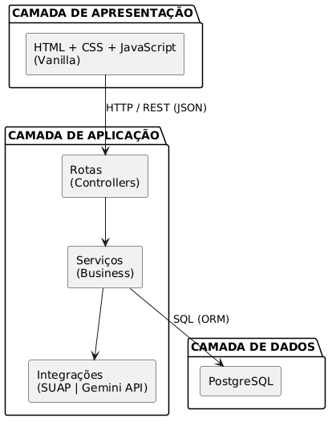
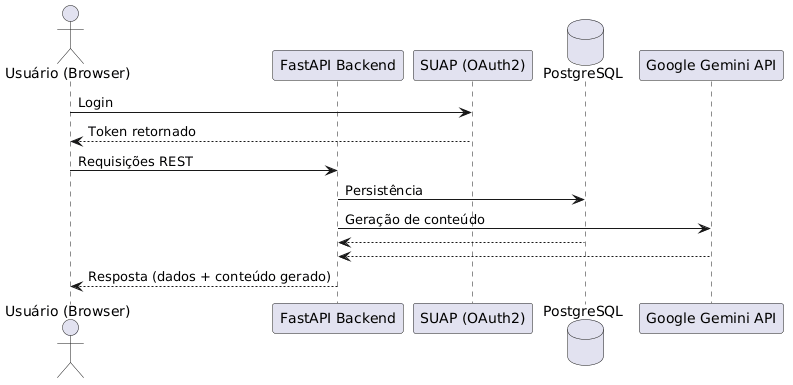
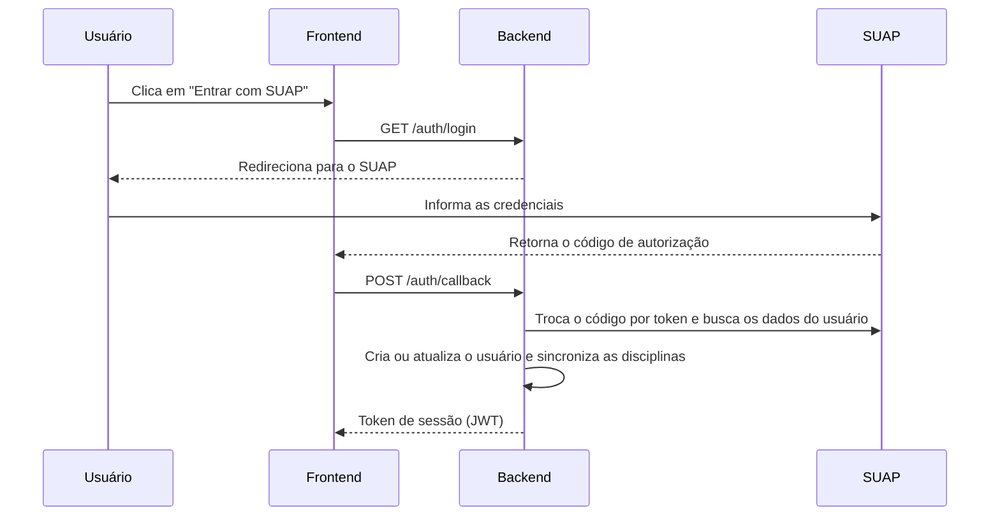
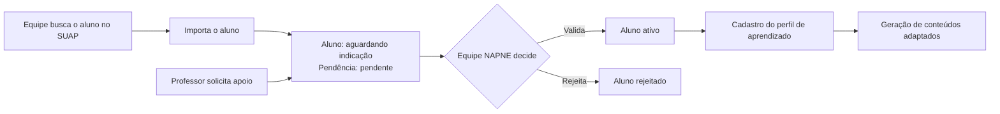
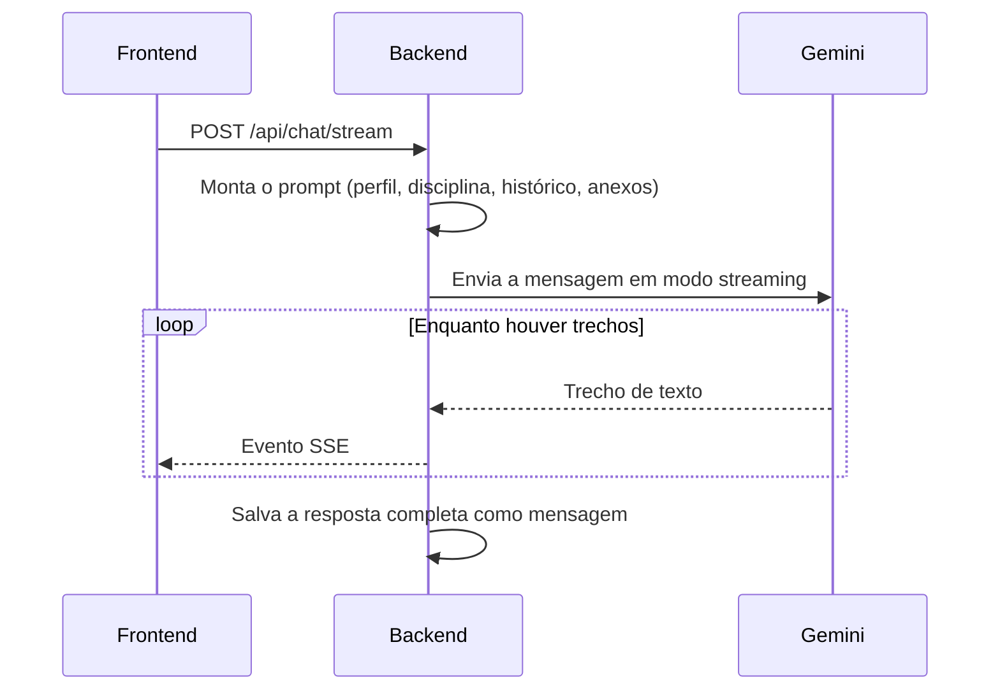
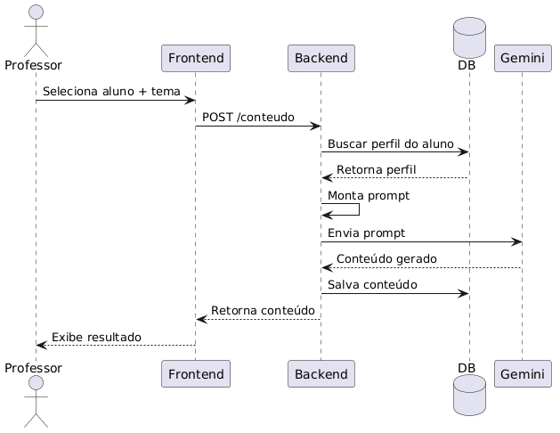
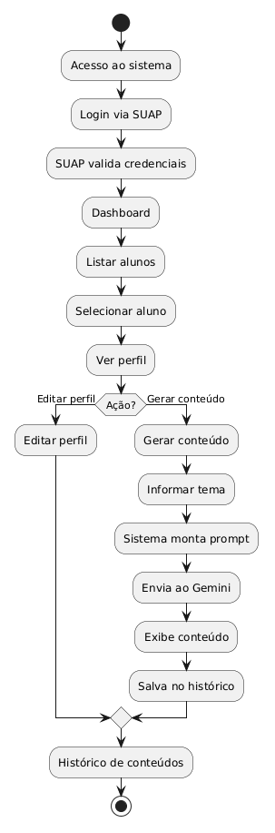

# Acolhe+ — Arquitetura
### Sistema de apoio à educação inclusiva com IA

## Sumário

1. [Arquitetura do sistema](#1-arquitetura-do-sistema)
2. [Organização de diretórios](#2-organização-de-diretórios)
3. [Backend](#3-backend)
4. [Frontend](#4-frontend)
5. [Banco de dados](#5-banco-de-dados)
6. [Integrações externas](#6-integrações-externas)
7. [Segurança e LGPD](#7-segurança-e-lgpd)
8. [Fluxos do sistema](#8-fluxos-do-sistema)
9. [Implantação](#9-implantação)

---

## 1. Arquitetura do sistema

### 1.1 Estilo arquitetural

O sistema adota a arquitetura **cliente-servidor em camadas**, com três camadas principais: apresentação, negócio e persistência. Cada camada só se comunica com a vizinha, o que permite alterar uma sem afetar as outras.



| Camada | Tecnologia | Responsabilidade |
|---|---|---|
| **Apresentação** | HTML, CSS e JavaScript puro | Interface com o usuário. Não tem regra de negócio. |
| **Negócio** | FastAPI (Python) | Regras de negócio, autorização, integração com SUAP e Gemini. |
| **Persistência** | PostgreSQL, SQLAlchemy e Alembic | Armazenamento dos dados e controle de versão do esquema. |

Além das três camadas, o sistema integra dois serviços externos: o **SUAP** (autenticação e dados acadêmicos) e o **Google Gemini** (IA generativa).

### 1.2 Visão macro do fluxo de dados



---

## 2. Organização de diretórios

```
acolhe/
├── main.py                  # Aplicação FastAPI: middlewares, rotas de páginas e routers
├── Procfile                 # Comando de inicialização (migrações + Uvicorn)
├── build.sh                 # Instalação de dependências, Tesseract e migrações
├── alembic.ini
├── requirements.txt
├── .env.example             # Modelo de variáveis de ambiente
│
├── backend/
│   ├── config.py            # Configurações (pydantic-settings, lê o .env)
│   ├── database.py          # Engine, sessão e Base do SQLAlchemy
│   ├── dependencies.py      # Dependências de autenticação e papéis (RBAC)
│   ├── security.py          # Hash de senha e JWT
│   ├── models/              # Entidades do banco (SQLAlchemy)
│   ├── schemas/             # Validação de entrada e saída (Pydantic)
│   ├── routers/             # Endpoints HTTP
│   ├── services/            # Regras de negócio e integrações
│   └── repositories/        # Acesso ao banco de dados
│
├── frontend/
│   ├── *.html               # Páginas (chat, painel, portal, disciplinas...)
│   ├── css/                 # Estilos por página e acessibilidade
│   └── js/                  # Scripts por página e bibliotecas
│
├── migrations/versions/     # Migrações do Alembic
├── scripts/                 # Scripts utilitários (admin, seed, backfill)
├── testes/                  # Configuração de testes (pytest)
├── uploads/                 # Arquivos enviados (materiais e anexos)
└── docs/                    # Documentação, requisitos e diagramas
```

---

## 3. Backend

### 3.1 Subcamadas

O backend é dividido em subcamadas com responsabilidades separadas:

| Subcamada | Pasta | Responsabilidade |
|---|---|---|
| **Routers** | `backend/routers/` | Recebem as requisições HTTP, definem os endpoints e aplicam as dependências de autorização. |
| **Services** | `backend/services/` | Contêm a lógica de negócio, a montagem de prompts, o controle das sessões de chat e as integrações externas. |
| **Repositories** | `backend/repositories/` | Encapsulam as consultas ao banco por meio do SQLAlchemy ORM. |
| **Schemas** | `backend/schemas/` | Validam os dados de entrada e saída com Pydantic. |
| **Models** | `backend/models/` | Representam as tabelas do banco. |

### 3.2 Routers

| Router | Prefixo | Função |
|---|---|---|
| `auth` | `/auth` | Login SUAP e local, logout, convites, disciplinas, observações e solicitação de apoio. |
| `portal` | `/portal` | Portal do aluno. |
| `equipe` | `/equipe` | Painel NAPNE: equipe, pendências e validação. |
| `importacao` | `/importacao` | Busca e importação de alunos do SUAP e cadastro manual. |
| `aluno` | `/alunos` | Consulta, perfil e exportação de alunos. |
| `conteudo_gerado` | `/conteudos` | Conteúdos gerados, iterações e histórico. |
| `chat` | `/api/chat` | Conversas, mensagens (inclusive streaming), anexos e geração de conteúdo. |
| `feedback` | `/api/feedback` | Avaliação dos conteúdos pelos professores. |
| `material` | `/api/materiais` | Materiais de apoio por disciplina. |
| `notificacao` | `/notificacoes` | Notificações. |
| `audit` | `/api/audit` | Consulta aos logs de auditoria. |
| `lgpd` | `/api/lgpd` | Exportação de dados pessoais. |
| `relatorios` | `/api/relatorios` | Relatório de uso, resumo de métricas e relatório de aluno em PDF. |
| `usuario` | `/usuarios` | Usuários. |

A lista completa de rotas está em [documentacao.md](documentacao.md#7-api).

### 3.3 Services

| Service | Responsabilidade |
|---|---|
| `ai_service` | Comunicação com o Gemini: sessões de chat, streaming, cache de respostas e novas tentativas. |
| `prompt_builder` | Montagem dos prompts a partir do perfil do aluno, observações, disciplina, materiais e anexos. |
| `suap_service` | Cliente da API do SUAP. |
| `auth_service` | Login, convites, pendências, observações e solicitação de apoio. |
| `chat_service` | Regras das conversas e das mensagens. |
| `aluno_service` | Regras de alunos e perfis. |
| `portal_service` | Regras do portal do aluno. |
| `material_service` | Upload, download e extração de texto dos materiais. |
| `notificacao_service` | Criação e controle de notificações. |
| `audit_service` | Registro dos logs de auditoria. |
| `text_extractor` | Extração de texto de PDF, documentos e imagens (com OCR via Tesseract, quando disponível). |
| `usuario_service` | Regras de usuários. |

### 3.4 Controle de acesso

O controle de acesso baseado em papéis (RBAC) é feito por dependências do FastAPI em `backend/dependencies.py`. Cada rota declara a dependência de que precisa:

| Dependência | Quem acessa |
|---|---|
| `get_current_usuario` | Qualquer usuário autenticado. |
| `require_napne` | Equipe NAPNE (psicopedagogo, servidor e administrador). |
| `require_psicopedagogo_or_admin` | Psicopedagogo ou administrador (por exemplo, convite de novos membros). |

Os papéis existentes são `aluno`, `professor`, `psicopedagogo`, `servidor` e `admin`.

### 3.5 Camada de IA

O `AIService` encapsula toda a comunicação com o Gemini.

**Modelo.** O modelo é definido pela variável `GEMINI_MODEL` (padrão `gemini-2.5-flash`).

**Montagem do prompt.** O `prompt_builder` combina as seguintes partes, cada uma com limite de tamanho para controlar o contexto enviado:

| Parte | Limite |
|---|---|
| Instrução de sistema (especialista em educação inclusiva) | — |
| Perfil do aluno: nível de atenção, dificuldade de leitura, preferência, interesses e diagnóstico | — |
| Observações dos professores | 1.500 caracteres |
| Ementa da disciplina | 3.000 caracteres |
| Materiais da disciplina | até 20 materiais, 1.500 caracteres cada, 8.000 no total |
| Anexos da conversa | até 10 anexos, 1.500 caracteres cada, 8.000 no total |
| Histórico da conversa | até 20 mensagens e 4.000 caracteres |
| Tarefa atual | — |

**Sessões de chat.** Cada conversa tem uma sessão no Gemini, reconstruída a partir do histórico salvo. Há um cache **LRU** de até 100 sessões, e cada sessão mantém até 16 mensagens, com um resumo do restante (até 2.000 caracteres).

**Cache de respostas.** Na geração de conteúdo, a resposta é guardada com chave baseada no hash do prompt. O cache guarda até 200 respostas (`AI_CACHE_MAX_SIZE`) e cada uma vale 24 horas (`AI_CACHE_TTL_SECONDS`).

**Streaming.** No chat, a resposta é lida do Gemini em uma thread separada e repassada ao cliente por **Server-Sent Events (SSE)**, à medida que os trechos são gerados. Ao final, o texto completo é salvo como mensagem da conversa.

**Resiliência.** Em caso de erro na API, o serviço tenta a chamada até 3 vezes antes de devolver uma mensagem de falha.

---

## 4. Frontend

### 4.1 Princípios

- Interface em HTML, CSS e JavaScript puro, sem frameworks, para manter o código leve.
- Comunicação com o backend somente por requisições REST (`fetch`), com SSE no streaming do chat.
- Conteúdo Markdown renderizado com `marked`, sempre sanitizado com **DOMPurify** para evitar XSS.
- Sem regra de negócio no cliente: as permissões são sempre verificadas no backend.

### 4.2 Páginas

| Página | Rota | Perfil | Função |
|---|---|---|---|
| `index.html` | `/` e `/login` | Todos | Login via SUAP e via conta local. |
| `chat.html` | `/chat` | Todos | Chat com a IA, com seleção de aluno e disciplina. |
| `conversas.html` | `/conversas` | Todos | Histórico de conversas. |
| `disciplinas.html` | `/disciplinas` | Professor | Disciplinas, alunos assistidos, observações e materiais. |
| `painel.html` | `/painel` | Equipe NAPNE | Equipe, pendências de validação, alunos ativos e relatórios. |
| `importacao.html` | `/importacao` | Equipe NAPNE | Busca e importação de alunos do SUAP. |
| `portal.html` | `/portal` | Aluno | Perfil, conteúdos e preferências. |
| `notificacoes.html` | `/notificacoes` | Todos | Lista de notificações. |

### 4.3 Acessibilidade

Como o público do sistema inclui pessoas com TEA e TDAH, a interface oferece um painel de acessibilidade (`acessibilidade.js` e `acessibilidade.css`) com:

- régua de leitura e modo de foco;
- fonte para dislexia (OpenDyslexic);
- modo para daltonismo;
- tema claro e escuro (`theme.js`).

As preferências ficam salvas no navegador do usuário.

---

## 5. Banco de dados

O banco é o **PostgreSQL**. O acesso é feito exclusivamente pelo backend, por meio do **SQLAlchemy ORM**, e o esquema é versionado pelo **Alembic** (`migrations/versions/`). Cada alteração no modelo vira uma migração versionada e reversível.

### 5.1 Principais relações

```
usuarios ──┬── contas_locais        (1:1, apenas contas locais)
           ├── disciplinas          (1:N, diários do professor)
           ├── conversas ── mensagens, anexos_conversa
           └── tokens_revogados

alunos ────┬── perfis_aluno         (1:1)
           ├── pendencias_validacao (1:N)
           ├── diario_alunos ── disciplinas
           ├── acomodacao_observacoes
           └── conteudos_gerados ── conteudo_feedback

disciplinas ── materiais
notificacoes ── notificacao_leitura
audit_logs   (registro das operações com dados sensíveis)
```

### 5.2 Decisões de projeto

- Integridade referencial com chaves estrangeiras e exclusão em cascata onde faz sentido.
- Auto-relacionamento em `conteudos_gerados` (`conteudo_pai_id`), que guarda o histórico de refinamentos de cada conteúdo.
- Tipos enumerados para nível de atenção, preferência de aprendizado e status.

O detalhamento de todas as tabelas e colunas está em [documentacao.md](documentacao.md#6-modelo-de-dados).

---

## 6. Integrações externas

### 6.1 SUAP

A integração é feita pelo `suap_service` e cobre dois usos.

**Autenticação (OAuth2).** O fluxo é o de código de autorização. O sistema redireciona o usuário ao SUAP (`GET /auth/login`) e recebe o retorno em `POST /auth/callback`. O escopo solicitado é `identificacao email documentos_pessoais ensino`. Com o token do SUAP, o backend cria ou atualiza o usuário local e emite o próprio token de sessão.

**Dados acadêmicos.** O cliente consulta a API do SUAP para:

- obter os dados e os vínculos do usuário autenticado;
- listar as disciplinas e os diários do professor no semestre vigente;
- listar os alunos de um diário;
- buscar alunos por nome ou matrícula, para a importação pela equipe NAPNE.

### 6.2 Google Gemini

A integração é feita pelo `ai_service` com o SDK `google-generativeai`. Os detalhes de prompt, sessões, cache, streaming e novas tentativas estão na seção [3.5](#35-camada-de-ia).

---

## 7. Segurança e LGPD

### 7.1 Autenticação

- **Login via SUAP** (OAuth2) para professores, alunos e servidores com vínculo institucional.
- **Login local** (e-mail e senha) para membros convidados do NAPNE.
- **Tokens JWT** com assinatura HMAC-SHA256 (HS256) e validade de 2 horas. A validação confere assinatura, expiração e tipo do token a cada requisição.
- **Logout** revoga o token (`tokens_revogados`), que passa a ser recusado.
- **Senhas** armazenadas com **bcrypt** (custo 12). Hashes antigos em PBKDF2-HMAC-SHA256 continuam sendo aceitos, por compatibilidade.
- **Contas locais** são bloqueadas por 30 minutos após 10 tentativas de login malsucedidas.
- Convites geram uma senha temporária de 10 caracteres.

### 7.2 Proteções da aplicação

| Proteção | Como funciona |
|---|---|
| **RBAC** | Dependências do FastAPI verificam o papel do usuário em cada rota. |
| **Rate limiting** | Chat: 10 requisições por minuto. Operações sensíveis: 20 por minuto. Login: 5 por 5 minutos. A chave é o usuário autenticado ou o IP. |
| **Cabeçalhos de segurança** | HSTS, `X-Content-Type-Options`, `X-Frame-Options: DENY`, Content-Security-Policy, Referrer-Policy e Permissions-Policy. |
| **CORS** | Origens permitidas definidas em `ALLOWED_ORIGINS`. |
| **Validação de entrada** | Schemas Pydantic. |
| **XSS** | DOMPurify no frontend. |
| **Segredos** | Chaves e credenciais em variáveis de ambiente (`.env`), fora do código. |
| **Rastreio** | Um identificador de requisição é gerado por um middleware. |
| **Uploads** | Limite de tamanho (10 MB) e lista de extensões permitidas. |

### 7.3 LGPD

- **Logs de auditoria** (`audit_logs`): registram o usuário responsável, a ação, o recurso, o aluno envolvido, o IP de origem e a data e hora das operações com dados sensíveis.
- **Exportação de dados pessoais** (`/api/lgpd`): qualquer usuário autenticado pode exportar os próprios dados em JSON, o que atende ao direito de acesso do Art. 18 da LGPD.
- **Restrição de campos clínicos**: no portal, o aluno edita apenas interesses e preferência de aprendizado. Diagnóstico, nível de atenção e dificuldade de leitura só são editados pela equipe NAPNE.
- **Dados enviados à IA**: o prompt inclui o perfil do aluno (inclusive o diagnóstico) e é enviado à API do Gemini. Esse fluxo deve ser considerado na política de privacidade da instituição.

---

## 8. Fluxos do sistema

### 8.1 Login via SUAP


```mermaid
sequenceDiagram
    participant U as Usuário
    participant F as Frontend
    participant B as Backend
    participant S as SUAP
    U->>F: Clica em "Entrar com SUAP"
    F->>B: GET /auth/login
    B-->>U: Redireciona para o SUAP
    U->>S: Informa as credenciais
    S-->>F: Retorna o código de autorização
    F->>B: POST /auth/callback
    B->>S: Troca o código por token e busca os dados do usuário
    B->>B: Cria ou atualiza o usuário e sincroniza as disciplinas
    B-->>F: Token de sessão (JWT)
```

### 8.2 Importação e validação de um aluno


```mermaid
flowchart LR
    A[Equipe busca o aluno no SUAP] --> B[Importa o aluno]
    B --> C[Aluno: aguardando indicação<br/>Pendência: pendente]
    P[Professor solicita apoio] --> C
    C --> D{Equipe NAPNE decide}
    D -->|Valida| E[Aluno ativo]
    D -->|Rejeita| F[Aluno rejeitado]
    E --> G[Cadastro do perfil de aprendizado]
    G --> H[Geração de conteúdos adaptados]
```

### 8.3 Chat com IA em streaming


```mermaid
sequenceDiagram
    participant F as Frontend
    participant B as Backend
    participant G as Gemini
    F->>B: POST /api/chat/stream
    B->>B: Monta o prompt (perfil, disciplina, histórico, anexos)
    B->>G: Envia a mensagem em modo streaming
    loop Enquanto houver trechos
        G-->>B: Trecho de texto
        B-->>F: Evento SSE
    end
    B->>B: Salva a resposta completa como mensagem
```

### 8.4 Diagrama de sequência do sistema



### 8.5 Fluxo geral do sistema



---

## 9. Implantação

- **Servidor de aplicação:** Uvicorn (ASGI), iniciado pelo `Procfile` depois das migrações.
- **Build:** o `build.sh` instala as dependências, tenta instalar o Tesseract OCR (com o idioma português) e executa as migrações. Sem o Tesseract, o OCR fica desabilitado e o restante do sistema funciona normalmente.
- **Configuração:** todas as credenciais e parâmetros vêm de variáveis de ambiente (ver [documentacao.md](documentacao.md#10-configuração-e-execução)).
- **Arquivos enviados:** ficam na pasta definida em `UPLOADS_DIR`.
- **Saúde:** a rota `/health` permite verificar se a aplicação está no ar.