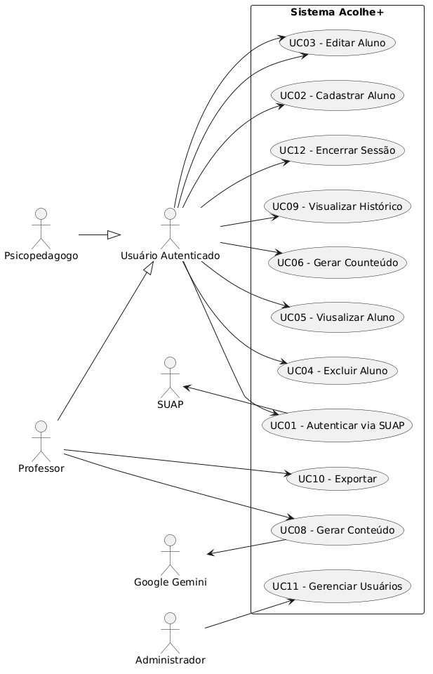
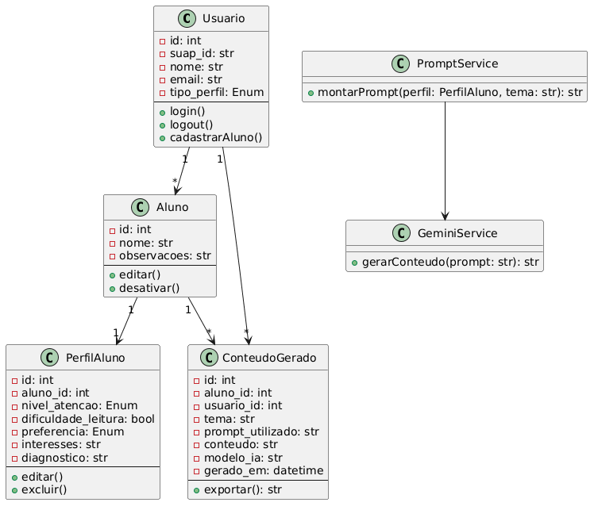
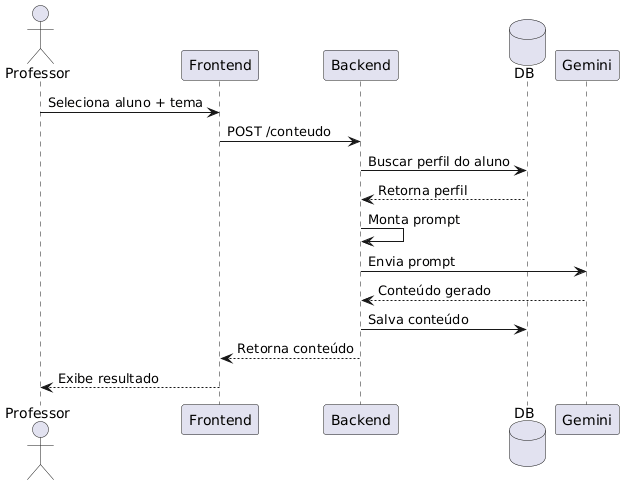

# Acolhe+ — Documentação 
### Sistema de Apoio à Educação Inclusiva com IA

## Sumário

1. [Visão Geral do Sistema](#1-visão-geral-do-sistema)
2. [Requisitos do Sistema](#2-requisitos-do-sistema)
3. [User Stories](#3-user-stories)
4. [Casos de Uso](#4-casos-de-uso)
5. [Modelo de Dados](#5-modelo-de-dados)
6. [Diagramas](#6-diagramas)
7. [Modelo de Dados](#7-modelo-de-dados)
8. [Diagramas](#8-diagramas)
9. [Fluxo do Sistema](#9-fluxo-do-sistema)

---

## 1. Visão Geral do Sistema

### 1.1 Descrição

O **Acolhe+** é um sistema web voltado ao apoio da educação inclusiva, desenvolvido para auxiliar professores e psicopedagogos na personalização do ensino para alunos com necessidades específicas, especialmente aqueles com transtornos do neurodesenvolvimento.

O sistema utiliza Inteligência Artificial (Google Gemini) para gerar conteúdos educacionais adaptados ao perfil individual de cada aluno, promovendo a integração entre o conhecimento técnico do professor e o conhecimento comportamental do psicopedagogo.

### 1.2 Atores do Sistema

- **Professor**: cadastra alunos, seleciona disciplinas e solicita geração de conteúdo.
- **Psicopedagogo**: cadastra e edita perfis comportamentais dos alunos.
- **Administrador**: gerencia usuários e parâmetros do sistema.

---

## 2. Requisitos do Sistema

### 2.1 Requisitos Funcionais (RF)

| ID | Requisito | Prioridade |
|---|---|---|
| RF01 | O sistema deve permitir autenticação via SUAP | Alta |
| RF02 | O usuário autenticado deve poder cadastrar alunos | Alta |
| RF03 | O sistema deve permitir o cadastro e edição do perfil detalhado do aluno | Alta |
| RF04 | O perfil do aluno deve conter: nível de atenção, dificuldade de leitura, preferência de aprendizado, interesses e observações gerais | Alta |
| RF05 | O sistema deve permitir selecionar um tema ou disciplina para geração de conteúdo | Alta |
| RF06 | O sistema deve montar automaticamente um prompt com base no perfil do aluno | Alta |
| RF07 | O sistema deve enviar o prompt à API do Google Gemini e exibir o conteúdo gerado | Alta |
| RF08 | O sistema deve salvar o histórico de conteúdos gerados por aluno | Média |
| RF09 | O usuário deve poder visualizar o histórico de conteúdos gerados | Média |
| RF10 | O administrador deve poder gerenciar usuários do sistema | Média |

### 3.2 Requisitos Não Funcionais (RNF)

| ID | Requisito | Categoria |
|---|---|---|
| RNF01 | A interface deve ser responsiva (desktop e dispositivos móveis) | Usabilidade |
| RNF02 | As senhas e tokens de autenticação não devem ser armazenados em texto simples | Segurança |
| RNF03 | O acesso às funcionalidades deve ser restrito por perfil (professor / psicopedagogo / admin) | Segurança |
| RNF04 | As chaves de API (Gemini, SUAP) devem ser armazenadas em variáveis de ambiente | Segurança |
| RNF5 | O código deve ser documentado e organizado para facilitar manutenção futura | Manutenibilidade |

---

## 3. User Stories

### US01 — Login via SUAP
**Como** professor ou psicopedagogo,  
**quero** fazer login utilizando meu usuário e senha do SUAP,  
**para que** eu não precise criar uma nova conta e o acesso seja institucional.

**Critérios de aceitação:**
- O botão de login redireciona para o SUAP.
- Após autenticação bem-sucedida, o usuário é redirecionado ao dashboard do Acolhe+.
- O nome do usuário é exibido na interface após o login.

---

## 4. Casos de Uso

### 4.1 Atores
- **Usuário Autenticado** (generalização de Professor e Psicopedagogo)
- **Professor** (especialização)
- **Psicopedagogo** (especialização)
- **Administrador**
- **SUAP** (sistema externo)
- **Google Gemini** (sistema externo)

### 4.2 Tabela de Casos de Uso

| ID | Nome | Ator Principal | Descrição |
|---|---|---|---|
| UC01 | Autenticar via SUAP | Usuário | Redireciona ao SUAP, valida token e cria sessão local |
| UC02 | Cadastrar Aluno | Prof. / Psicopedagogo | Registra dados de um novo aluno |
| UC03 | Editar Aluno | Prof. / Psicopedagogo | Atualiza dados básicos do aluno |
| UC04 | Excluir Aluno | Prof. / Psicopedagogo | Remove um aluno do sistema |
| UC05 | Visualizar Aluno | Prof. / Psicopedagogo | Exibe os dados e perfil completo de um aluno |
| UC06 | Gerar Conteúdo Adaptado | Professor | Monta prompt com perfil, envia ao Gemini e exibe resultado |
| UC07 | Visualizar Histórico | Prof. / Psicopedagogo | Lista conteúdos gerados para um aluno |
| UC08 | Exportar Conteúdo | Professor | Copia ou baixa o conteúdo gerado |
| UC09 | Gerenciar Usuários | Administrador | Visualiza, ativa e desativa usuários |
| UC10 | Encerrar Sessão | Usuário | Faz logout do sistema |

---

## 5. Modelo de Dados

### 5.1 Entidades e Atributos

#### Tabela: `usuario`
| Coluna | Tipo | Descrição |
|---|---|---|
| id | SERIAL PK | Identificador único |
| suap_id | VARCHAR(50) UNIQUE | Identificador do usuário no SUAP |
| nome | VARCHAR(200) | Nome completo |
| email | VARCHAR(200) | E-mail institucional |
| tipo_perfil | ENUM('professor', 'psicopedagogo', 'admin') | Tipo de acesso |

#### Tabela: `aluno`
| Coluna | Tipo | Descrição |
|---|---|---|
| id | SERIAL PK | Identificador único |
| nome | VARCHAR(200) | Nome completo do aluno |
| observacoes | TEXT | Observações gerais |

#### Tabela: `perfil_aluno`
| Coluna | Tipo | Descrição |
|---|---|---|
| id | SERIAL PK | Identificador único |
| aluno_id | INT FK → aluno.id | Referência ao aluno |
| nivel_atencao | ENUM('alto', 'medio', 'baixo') | Nível geral de atenção |
| dificuldade_leitura | BOOLEAN | Indica se há dificuldade de leitura |
| preferencia | ENUM('visual', 'auditivo', 'cinestetico', 'leitura_escrita', 'misto') | Estilo de aprendizado preferido |
| interesses | TEXT | Temas/assuntos de interesse do aluno |
| diagnostico | VARCHAR(200) | Diagnóstico (opcional) |

#### Tabela: `conteudo_gerado`
| Coluna | Tipo | Descrição |
|---|---|---|
| id | SERIAL PK | Identificador único |
| aluno_id | INT FK → aluno.id | Aluno para o qual foi gerado |
| usuario_id | INT FK → usuario.id | Usuário que solicitou a geração |
| tema | VARCHAR(300) | Tema/disciplina informado |
| prompt_utilizado | TEXT | Prompt enviado à IA (para auditoria) |
| conteudo | TEXT | Conteúdo retornado pela IA |
| modelo_ia | VARCHAR(100) | Modelo do Gemini utilizado |
| gerado_em | TIMESTAMP | Data e hora da geração |

---

## 6. Diagramas

### 6.1 Diagrama de Casos de Uso

---

### 8.2 Diagrama de Classes

---

### 8.3 Diagrama de Sequência 

---
