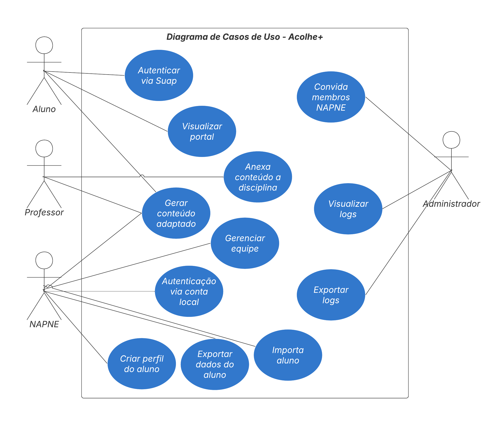
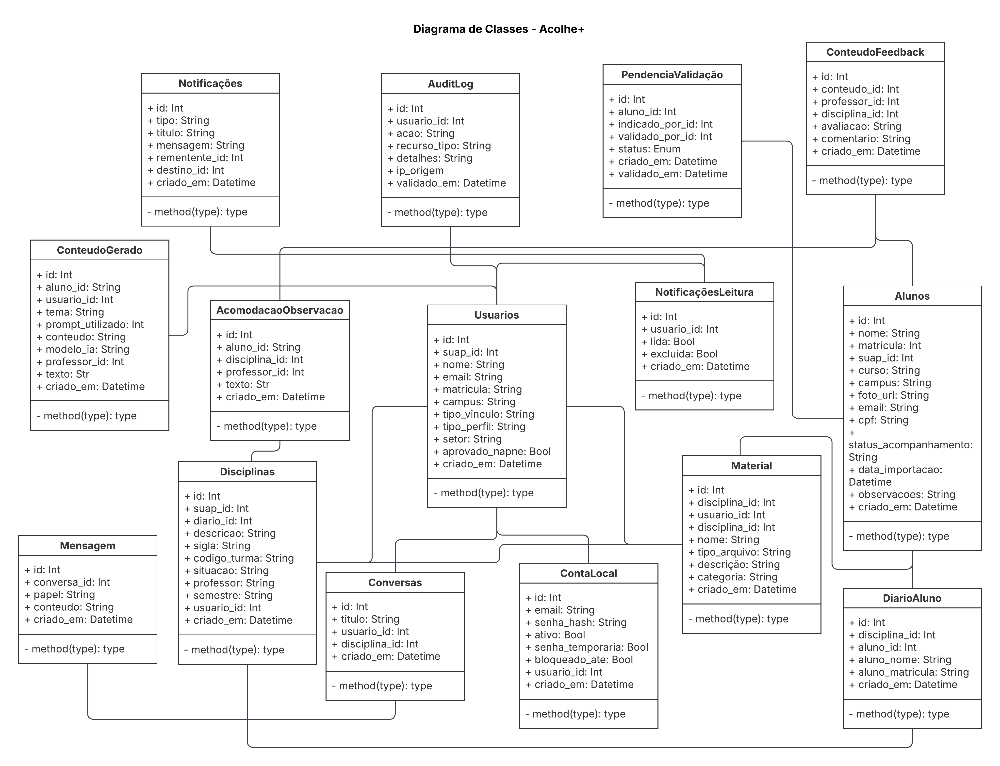

# Acolhe+ — Documentação
### Sistema de apoio à educação inclusiva com IA

## Sumário

1. [Visão geral](#1-visão-geral)
2. [Requisitos do sistema](#2-requisitos-do-sistema)
3. [Papéis e permissões](#3-papéis-e-permissões)
4. [Casos de uso](#4-casos-de-uso)
5. [Histórias de usuário](#5-histórias-de-usuário)
6. [Modelo de dados](#6-modelo-de-dados)
7. [API](#7-api)
8. [Diagramas](#8-diagramas)
9. [Fluxos do sistema](#9-fluxos-do-sistema)
10. [Configuração e execução](#10-configuração-e-execução)

---

## 1. Visão geral

### 1.1 Descrição

O **Acolhe+** é uma aplicação web que apoia a personalização do ensino de alunos com Transtorno do Espectro Autista (TEA) e Transtorno do Déficit de Atenção e Hiperatividade (TDAH). Ele foi desenvolvido para o Núcleo de Atendimento às Pessoas com Necessidades Educacionais Específicas (NAPNE) do IFRN, Campus Nova Cruz, como Trabalho de Conclusão de Curso de Análise e Desenvolvimento de Sistemas.

O sistema organiza as informações do perfil de aprendizagem de cada aluno e usa a API do Google Gemini para gerar conteúdos educacionais adaptados a esse perfil. A autenticação é feita com as credenciais do SUAP, e os dados de alunos e disciplinas são importados do próprio SUAP.

### 1.2 Atores do sistema

| Ator | Descrição |
|---|---|
| **Aluno** | Estudante acompanhado pelo NAPNE. Acessa o portal, vê seu perfil e conteúdos, edita suas preferências e conversa com a IA. |
| **Professor** | Docente de disciplina regular. Vê suas turmas, solicita apoio ao NAPNE, registra observações pedagógicas, avalia conteúdos e conversa com a IA. |
| **Psicopedagogo** | Membro do NAPNE. Importa alunos, valida indicações, cadastra perfis, gera conteúdos e convida novos membros. |
| **Servidor** | Integrante da equipe NAPNE com acesso ao painel de acompanhamento. Não convida novos membros. |
| **Administrador** | Acesso total, incluindo a desativação de contas de membros da equipe. |
| **SUAP** | Sistema externo de autenticação (OAuth2) e de dados acadêmicos. |
| **Google Gemini** | Serviço externo de IA generativa. |

### 1.3 Principais funcionalidades

- Login via SUAP e via conta local (membros convidados).
- Importação de alunos do SUAP (ou cadastro manual) e validação de indicações pela equipe NAPNE.
- Cadastro do perfil de aprendizado: nível de atenção, dificuldade de leitura, preferência, interesses e diagnóstico.
- Geração de conteúdo educacional adaptado, com histórico e versionamento.
- Chat com IA contextualizado ao aluno e/ou à disciplina, com streaming de respostas e anexos.
- Portal do aluno, com edição de interesses e preferência de aprendizado.
- Observações pedagógicas dos professores e solicitação de apoio ao NAPNE.
- Feedback dos professores sobre os conteúdos gerados.
- Materiais de apoio por disciplina e notificações.
- Exportação de dados (CSV e PDF), relatórios de uso e exportação de dados pessoais (LGPD).
- Logs de auditoria para operações com dados sensíveis.
- Recursos de acessibilidade na interface: régua de leitura, foco, fonte para dislexia e modo para daltonismo.

---

## 2. Requisitos do sistema

### 2.1 Requisitos funcionais (RF)

| ID | Requisito | Prioridade |
|---|---|---|
| RF01 | O sistema deve permitir autenticação via SUAP e via conta local | Alta |
| RF02 | O sistema deve permitir o cadastro de alunos | Alta |
| RF03 | O sistema deve permitir o cadastro e edição do perfil de aprendizado do aluno | Alta |
| RF04 | O sistema deve permitir a geração de conteúdo educacional adaptado via integração com IA generativa | Alta |
| RF05 | O sistema deve oferecer chat com IA contextualizado ao perfil do aluno e/ou à disciplina | Alta |
| RF06 | O sistema deve salvar o histórico de conteúdos gerados e conversas realizadas | Alta |
| RF07 | O sistema deve permitir que professores registrem observações pedagógicas por aluno e disciplina | Alta |
| RF08 | O sistema deve oferecer portal do aluno com visualização de perfil e conteúdos gerados | Média |
| RF09 | O sistema deve permitir o gerenciamento de usuários e equipe pelo NAPNE | Média |
| RF10 | O sistema deve registrar logs de auditoria para todas as operações com dados sensíveis | Média |
| RF11 | O sistema deve permitir a importação de alunos a partir do SUAP pela equipe NAPNE | Alta |
| RF12 | O sistema deve permitir que a equipe NAPNE valide ou rejeite as indicações de alunos para acompanhamento | Alta |
| RF13 | O sistema deve permitir que professores solicitem o apoio do NAPNE para alunos de suas turmas | Alta |
| RF14 | O sistema deve permitir a exportação de dados de alunos e a geração de relatórios de uso pela equipe NAPNE | Média |

### 2.2 Requisitos não funcionais (RNF)

| ID | Requisito | Categoria |
|---|---|---|
| RNF01 | As senhas devem ser armazenadas com hash seguro (bcrypt) | Segurança |
| RNF02 | O controle de acesso deve ser baseado em papéis (aluno, professor, psicopedagogo, servidor, admin) | Segurança |
| RNF03 | As chaves de API devem ser armazenadas em variáveis de ambiente | Segurança |
| RNF04 | O sistema deve ser responsivo para acesso em dispositivos móveis | Usabilidade |
| RNF05 | O chat com IA deve suportar streaming de respostas em tempo real | Desempenho |
| RNF06 | O sistema deve implementar cache para reduzir chamadas redundantes à API de IA | Desempenho |
| RNF07 | O sistema deve conformar-se à Lei Geral de Proteção de Dados (LGPD) | Legal |

---

## 3. Papéis e permissões

O controle de acesso é feito por dependências do FastAPI (`backend/dependencies.py`), que verificam o token e o tipo de perfil em cada rota.

| Funcionalidade | Aluno | Professor | Servidor | Psicopedagogo | Admin |
|---|:-:|:-:|:-:|:-:|:-:|
| Portal do aluno e edição de preferências | ✔ | | | | |
| Chat com IA | ✔ | ✔ | ✔ | ✔ | ✔ |
| Disciplinas, observações e solicitação de apoio | | ✔ | | | |
| Avaliar conteúdos gerados (feedback) | | ✔ | ✔ | ✔ | ✔ |
| Painel NAPNE, importação e validação de indicações | | | ✔ | ✔ | ✔ |
| Cadastro de perfil e geração de conteúdos | | | ✔ | ✔ | ✔ |
| Anexos no chat | | | ✔ | ✔ | ✔ |
| Exportações, relatórios e logs de auditoria | | | ✔ | ✔ | ✔ |
| Convidar novos membros | | | | ✔ | ✔ |
| Desativar contas de membros | | | | | ✔ |
| Exportar os próprios dados (LGPD) | ✔ | ✔ | ✔ | ✔ | ✔ |

> A coluna "Servidor" segue a dependência `require_napne`, que reúne psicopedagogo, servidor e administrador. Ver a coluna "Acesso" das rotas na seção 7.

---

## 4. Casos de uso

| ID | Caso de uso | Ator principal | História de usuário |
|---|---|---|---|
| UC01 | Autenticar via SUAP | Aluno, professor ou equipe NAPNE | HU01 |
| UC01 | Autenticar via SUAP | Aluno, professor ou equipe NAPNE | HU02 |
| UC01 | Autenticar via SUAP | Aluno, professor ou equipe NAPNE | HU03 |
| UC02 | Autenticar via conta local | Membro convidado do NAPNE | HU04 |
| UC03 | Importar alunos do SUAP | Equipe NAPNE | HU05 |
| UC04 | Cadastrar perfil de aprendizado | Equipe NAPNE | HU06 |
| UC05 | Gerar conteúdo adaptado | Equipe NAPNE | HU07 |
| UC06 | Conversar com IA | Aluno ou professor | HU08 |
| UC07 | Visualizar portal do aluno | Aluno | HU09 |
| UC08 | Editar preferências | Aluno | HU10 |
| UC09 | Gerenciar equipe | Psicopedagogo ou administrador | HU11 |
| UC10 | Exportar dados do aluno | Equipe NAPNE | HU12 |
| UC11 | Visualizar logs de auditoria | Equipe NAPNE | HU13 |
| UC12 | Exportar dados pessoais | Usuário autenticado | HU14 |
| UC13 | Validar indicações de alunos | Equipe NAPNE | HU15 |
| UC14 | Registrar observação pedagógica | Professor | HU16 |
| UC15 | Solicitar apoio do NAPNE | Professor | HU17 |

Um caso de uso pode ser detalhado por mais de uma história (o UC01 tem uma para cada perfil).

---

## 5. Histórias de usuário

### HU01 – Login e sincronização automática de disciplinas (aluno)

Como aluno do IFRN, quero realizar o login no Acolhe+ utilizando minhas credenciais do SUAP, para visualizar automaticamente as disciplinas que estou cursando no semestre atual sem precisar cadastrá-las manualmente.

**Critérios de aceitação**

- O sistema deve autenticar o usuário por meio do serviço de autenticação do SUAP e validar as credenciais.
- No primeiro acesso, o sistema deve criar o perfil do aluno no banco de dados do Acolhe+, importando nome completo, matrícula, e-mail institucional e campus.
- O sistema deve consultar a API do SUAP para buscar a lista de disciplinas em que o aluno está matriculado no período letivo vigente.
- O sistema deve atualizar essa lista a cada novo login, para que trancamentos ou novas matrículas sejam refletidos.
- Após o login, o aluno deve ser direcionado a uma tela inicial (dashboard) com as disciplinas matriculadas.
- As disciplinas devem ser exibidas em cards individuais (estilo Google Sala de Aula), contendo o nome da disciplina e o nome do professor responsável.
- Caso o SUAP esteja fora do ar, o sistema deve exibir uma mensagem amigável informando que a sincronização não foi possível no momento.

### HU02 – Login e diários de classe (professor)

Como professor, quero acessar o Acolhe+ com minhas credenciais , para visualizar de forma organizada meus diários e ementas do semestre e identificar quais turmas possuem alunos assistidos pela equipe psicopedagógica.

**Critérios de aceitação**

- O login deve ser realizado por meio de credenciais, identificando o vínculo de "Servidor/Professor".
- No primeiro acesso, o sistema deve criar o perfil do professor no banco de dados do Acolhe+, importando nome completo, matrícula, e-mail institucional e campus.
- O sistema deve importar o nome da disciplina, o código da turma (por exemplo, 1.1001.1V) e a ementa simplificada, quando disponível.
- Após o login, o professor deve visualizar cards, cada um representando uma turma ou disciplina que possua alunos assistidos pela equipe psicopedagógica.
- Cada card deve exibir o nome da disciplina, o código da turma e a quantidade de alunos assistidos pela equipe psicopedagógica.
- Ao clicar em um card, o professor deve ser levado à lista de alunos daquela turma assistidos pela equipe psicopedagógica.

### HU03 – Autenticação e autorização da equipe multidisciplinar

Como servidor(a) integrante da equipe multidisciplinar do NAPNE, quero acessar o Acolhe+ com minhas credenciais, para gerenciar as informações dos alunos que precisam ser assistidos.

**Critérios de aceitação**

- O login deve ser realizado por meio de credenciais, identificando o vínculo do usuário.
- No primeiro acesso, o sistema deve criar o perfil no banco de dados do Acolhe+, importando nome completo, matrícula, e-mail institucional e campus.
- Caso o servidor faça parte da equipe, mas ainda não esteja associado ao NAPNE no sistema, deverá solicitar o acesso ao administrador do sistema.
- Diferentemente do professor, que visualiza diários, o integrante da equipe deve ser direcionado a um painel com: barra de busca de alunos; lista de "Pendências de Validação" (alunos indicados por colegas que aguardam sua validação); e resumo dos alunos ativos sob sua responsabilidade.

### HU04 – Autenticação via conta local

Como membro convidado do NAPNE, quero acessar o Acolhe+ com e-mail e senha, para utilizar o sistema sem depender de um vínculo institucional no SUAP.

**Critérios de aceitação**

- O sistema deve autenticar o usuário com o e-mail e a senha cadastrados no momento do convite.
- Em caso de e-mail ou senha incorretos, o sistema deve exibir uma mensagem de erro que não revele qual dos dois dados está errado.
- O sistema deve negar o acesso a contas desativadas.
- Após 10 tentativas de login malsucedidas, o sistema deve bloquear a conta por 30 minutos.
- O sistema deve permitir que o usuário altere sua senha informando a senha atual, o que deve remover a marcação de senha temporária da conta.

### HU05 – Importação de alunos

Como membro da equipe do NAPNE, quero importar os alunos no sistema e iniciar o processo de indicação de acompanhamento.

**Critérios de aceitação**

- O acesso deve ser restrito aos membros da equipe NAPNE.
- O sistema deve oferecer um campo de busca em que seja possível digitar o nome ou a matrícula do aluno.
- Caso o aluno já tenha sido importado, o sistema deve indicar seu status atual e impedir uma nova importação.
- Ao importar um aluno, o sistema deve copiar seus dados cadastrais essenciais para a base local, criando o registro com o status de acompanhamento "aguardando indicação".
- A importação deve criar uma pendência de validação com status "pendente" e notificar a equipe NAPNE.

### HU06 – Cadastro de perfil de aprendizado

Como psicopedagogo ou membro da equipe do NAPNE, quero cadastrar e editar o perfil de aprendizado dos alunos importados do SUAP, para que o sistema possa gerar conteúdos e estratégias pedagógicas adaptadas às necessidades específicas de cada aluno.

**Critérios de aceitação**

- O sistema deve permitir registrar informações como nível de atenção, dificuldade de leitura, preferência de aprendizado, interesses e diagnóstico.
- O perfil deve ser vinculado diretamente ao registro do aluno importado.
- O sistema deve permitir atualizações parciais do perfil sem perder as informações já preenchidas anteriormente.
- O acesso a esta funcionalidade deve ser restrito a membros autenticados da equipe NAPNE.

### HU07 – Geração de conteúdo adaptado via IA

Como membro da equipe do NAPNE, quero gerar conteúdos educacionais adaptados com base no perfil de um aluno específico, para utilizar em atividades pedagógicas inclusivas e personalizadas em sala de aula.

**Critérios de aceitação**

- O sistema deve integrar-se a um modelo de IA generativa (por exemplo, Google Gemini) para criar o conteúdo.
- O prompt de geração deve incluir automaticamente os dados do perfil do aluno (nível de atenção, preferências, interesses e diagnóstico).
- O conteúdo gerado deve ser salvo no histórico do aluno para consultas futuras.
- O sistema deve exibir metadados do conteúdo, como o tema, o modelo de IA utilizado e a data de geração.

### HU08 – Assistente virtual e chat com IA

Como aluno ou professor, quero conversar com um assistente virtual especializado em educação inclusiva, para obter orientações, tirar dúvidas e receber apoio personalizado em tempo real.

**Critérios de aceitação**

- O sistema deve manter o histórico de conversas e mensagens salvas no banco de dados, permitindo retomar o diálogo em sessões futuras.
- O usuário deve poder criar novas conversas, alternar entre conversas antigas na barra lateral e excluir conversas.
- Em caso de indisponibilidade ou erro na comunicação com a IA, o sistema deve exibir uma mensagem de fallback amigável na tela de chat.
- O título da conversa deve ser gerado automaticamente com base na primeira mensagem enviada.

### HU09 – Portal de autoatendimento do aluno

Como aluno do IFRN, quero acessar um portal pessoal com meu perfil e os conteúdos gerados para mim, para acompanhar meu desenvolvimento e revisar os materiais adaptados disponibilizados pela equipe.

**Critérios de aceitação**

- O portal deve exibir dados básicos do aluno (nome, matrícula, curso, campus) importados do SUAP e seu status atual de acompanhamento.
- O aluno deve conseguir visualizar a lista de conteúdos gerados pela equipe, ordenados do mais recente para o mais antigo, com opção de expandir para ler o texto integral.
- O acesso deve ser restrito ao próprio aluno, utilizando o seu "suap_id" como identificador de vínculo.
- Caso o aluno ainda não possua perfil ou conteúdos vinculados, o sistema deve exibir telas de estado vazio amigáveis.

### HU10 – Edição de preferências pelo aluno

Como aluno assistido, quero atualizar minhas preferências de aprendizado e meus interesses pessoais por meio do meu portal, para que o sistema e a equipe NAPNE possam considerar minhas atualizações na criação de novos conteúdos.

**Critérios de aceitação**

- O aluno deve poder editar os campos de "preferência de aprendizado" e "interesses" por meio de um formulário no portal.
- O sistema deve salvar as alterações no perfil de aprendizado (PerfilAluno) vinculado ao aluno.
- Apenas os campos editados devem ser atualizados, preservando os demais dados do perfil (como diagnóstico e nível de atenção, que são restritos ao NAPNE).
- O sistema deve fornecer um feedback visual (toast) de sucesso após o salvamento e desabilitar o botão caso não haja alterações.

### HU11 – Gerenciamento de equipe e convites

Como psicopedagogo ou administrador do NAPNE, quero convidar novos membros para a equipe e gerenciar seus acessos, para garantir que apenas pessoas autorizadas atuem no acompanhamento dos alunos.

**Critérios de aceitação**

- O sistema deve permitir criar convites informando nome, e-mail e tipo de perfil (psicopedagogo, servidor ou administrador).
- O sistema deve gerar uma senha temporária de 10 caracteres e exibi-la na tela para ser repassada ao convidado, marcando a conta como de senha temporária (exceto para administradores).
- O administrador deve poder desativar contas de membros da equipe, com a restrição de que um administrador não pode desativar a própria conta.
- O sistema deve validar e bloquear (HTTP 409) convites para e-mails já cadastrados na plataforma.

### HU12 – Exportação de dados e relatórios pelo NAPNE

Como membro do NAPNE, quero exportar os dados dos alunos e gerar relatórios, para acompanhar o atendimento e registrar as informações fora do sistema.

**Critérios de aceitação**

- A funcionalidade deve ser restrita aos membros da equipe NAPNE; os demais perfis devem receber resposta de acesso negado.
- O sistema deve exportar a lista de alunos em CSV, com identificador, matrícula, nome, e-mail, curso, campus, status de acompanhamento e diagnóstico.
- O sistema deve exportar os dados de um aluno específico (dados cadastrais, perfil de aprendizado e conteúdos gerados), inclusive em PDF.
- O sistema deve gerar um relatório de uso em CSV, com filtro opcional por período, contendo informações como conteúdos gerados e feedbacks.

### HU13 – Consulta aos logs de auditoria

Como membro do NAPNE, quero visualizar os logs de auditoria dos dados de um aluno, para saber quem acessou ou alterou informações sensíveis.

**Critérios de aceitação**

- O sistema deve registrar as operações realizadas com dados sensíveis dos alunos, incluindo o usuário responsável, a ação, o recurso acessado, o IP de origem e a data e hora.
- O acesso à consulta deve ser restrito aos membros da equipe NAPNE.
- A consulta deve ser feita por aluno e permitir paginação dos registros.

### HU14 – Exportação de dados pessoais (LGPD)

Como usuário do sistema, quero exportar todos os meus dados pessoais, para exercer o direito de acesso previsto no Art. 18 da LGPD.

**Critérios de aceitação**

- O sistema deve permitir que qualquer usuário autenticado exporte seus próprios dados.
- A exportação deve incluir dados cadastrais, conteúdos gerados, conversas e mensagens, notificações e registros de auditoria relacionados ao usuário.
- O arquivo deve ser disponibilizado para download em formato JSON.
- O usuário só deve ter acesso aos seus próprios dados.

### HU15 – Validação e acompanhamento de alunos

Como membro do NAPNE, quero validar as indicações de alunos pendentes e acompanhar o status dos alunos ativos, para manter o controle sobre quais alunos estão recebendo atendimento e garantir o fluxo correto de entrada no sistema.

**Critérios de aceitação**

- O sistema deve exibir uma lista de "Pendências de Validação" com alunos que aguardam a indicação da equipe.
- O membro da equipe deve poder aprovar (mudando o status para "ativo") ou rejeitar (mudando para "rejeitado") a pendência de um aluno.
- Ao aprovar ou rejeitar, o status de acompanhamento do aluno deve ser atualizado automaticamente no banco de dados.
- Uma pendência que já foi processada não deve poder ser validada ou rejeitada novamente.
- Cada validação ou rejeição deve ser registrada no log de auditoria.
- O sistema deve permitir buscar alunos ativos por nome e exibir informações de diagnóstico e perfil de aprendizado na listagem.

### HU16 – Registro de observações pedagógicas

Como professor, quero registrar observações pedagógicas sobre um aluno assistido em minha disciplina, para que a equipe do NAPNE acompanhe as acomodações realizadas em sala de aula.

**Critérios de aceitação**

- O professor só deve poder registrar observações para alunos com os quais possui vínculo por meio de seus diários.
- O sistema deve manter uma observação por aluno e disciplina para cada professor, permitindo criá-la e atualizá-la.
- Ao registrar uma observação, o sistema deve notificar a equipe do NAPNE.
- As observações registradas devem ficar visíveis para a equipe no perfil do aluno.
- A criação e a atualização da observação devem ser registradas no log de auditoria.

### HU17 – Solicitação de apoio ao NAPNE

Como professor, quero solicitar o acompanhamento do NAPNE para um aluno de minha turma, para que a equipe avalie a necessidade de apoio especializado.

**Critérios de aceitação**

- O professor só deve poder solicitar apoio para alunos com os quais possui vínculo por meio de seus diários.
- O professor deve informar o motivo da solicitação.
- O sistema deve criar uma pendência de validação com status "pendente", registrando o professor que fez a indicação.
- Caso já exista uma pendência pendente para o aluno, o sistema deve bloquear a nova solicitação (HTTP 409).
- O sistema deve notificar os membros da equipe NAPNE sobre a nova solicitação e registrá-la no log de auditoria.


---

## 6. Modelo de dados

O banco é o **PostgreSQL**, acessado pelo **SQLAlchemy** e versionado pelo **Alembic** (`migrations/`). As tabelas abaixo foram extraídas dos modelos em `backend/models/`.

### 6.1 Valores controlados

| Campo | Valores |
|---|---|
| `perfis_aluno.nivel_atencao` | `alto`, `medio`, `baixo` |
| `perfis_aluno.preferencia` | `visual`, `auditivo`, `cinestesico`, `leitura_escrita`, `misto` |
| `pendencias_validacao.status` | `pendente`, `validado`, `rejeitado` |
| `alunos.status_acompanhamento` | `aguardando_indicacao`, `ativo`, `rejeitado` |
| `usuarios.tipo_perfil` | `aluno`, `professor`, `psicopedagogo`, `servidor`, `admin` |

### 6.2 Tabelas

#### `usuarios`
Usuários do sistema (alunos, professores e equipe), criados no primeiro login via SUAP ou por convite.

| Coluna | Tipo | Observações |
|---|---|---|
| `id` | int | PK |
| `suap_id` | String(50) | único |
| `nome` | String(200) |  |
| `email` | String(200) |  |
| `matricula` | String(50) | opcional |
| `campus` | String(200) | opcional |
| `tipo_vinculo` | String(100) | opcional |
| `tipo_perfil` | String(50) | padrão "aluno" |
| `setor` | String(200) | opcional |
| `aprovado_napne` | Boolean | padrão False |
| `criado_em` | datetime |  |

#### `contas_locais`
Credenciais das contas locais (membros convidados do NAPNE), com controle de bloqueio por tentativas.

| Coluna | Tipo | Observações |
|---|---|---|
| `id` | int | PK |
| `email` | String(200) | único |
| `senha_hash` | String(128) |  |
| `ativo` | Boolean | padrão True |
| `senha_temporaria` | Boolean | padrão True |
| `tentativas_login` | Integer | padrão 0 |
| `bloqueado_ate` | DateTime | opcional |
| `criado_em` | DateTime |  |
| `usuario_id` | Integer | FK → usuarios.id, único |

#### `tokens_revogados`
Tokens JWT revogados no logout.

| Coluna | Tipo | Observações |
|---|---|---|
| `id` | int | PK |
| `jti` | String(36) | único |
| `usuario_id` | Integer |  |
| `revogado_em` | DateTime |  |
| `expira_em` | DateTime |  |

#### `alunos`
Alunos importados do SUAP (ou cadastrados manualmente) e seu status de acompanhamento.

| Coluna | Tipo | Observações |
|---|---|---|
| `id` | int | PK |
| `nome` | String(200) |  |
| `matricula` | String(50) | único, opcional |
| `suap_id` | String(50) | único, opcional |
| `curso` | String(300) | opcional |
| `campus` | String(200) | opcional |
| `foto_url` | Text | opcional |
| `email` | String(200) | opcional |
| `cpf` | String(14) | opcional |
| `status_acompanhamento` | String(50) | padrão "aguardando_indicacao" |
| `data_importacao` | DateTime | opcional |
| `observacoes` | Text | opcional |
| `criado_em` | datetime |  |

#### `perfis_aluno`
Perfil de aprendizado do aluno, usado para personalizar os conteúdos gerados pela IA.

| Coluna | Tipo | Observações |
|---|---|---|
| `id` | int | PK |
| `aluno_id` | Integer | FK → alunos.id, único |
| `nivel_atencao` | Enum(NivelAtencao) | opcional |
| `dificuldade_leitura` | Boolean | padrão False |
| `preferencia` | Enum(PreferenciaAprendizado) | opcional |
| `interesses` | Text | opcional |
| `diagnostico` | String(200) | opcional |

#### `pendencias_validacao`
Indicações de alunos que aguardam validação da equipe NAPNE.

| Coluna | Tipo | Observações |
|---|---|---|
| `id` | int | PK |
| `aluno_id` | Integer | FK → alunos.id |
| `indicado_por_id` | Integer | FK → usuarios.id, opcional |
| `validado_por_id` | Integer | FK → usuarios.id, opcional |
| `motivo` | Text | opcional |
| `status` | Enum(StatusPendencia) | padrão StatusPendencia.pendente |
| `criado_em` | datetime |  |
| `validado_em` | DateTime | opcional |

#### `disciplinas`
Diários/disciplinas do professor sincronizados a partir do SUAP.

| Coluna | Tipo | Observações |
|---|---|---|
| `id` | int | PK |
| `suap_id` | Integer |  |
| `diario_id` | Integer | opcional |
| `descricao` | String(300) |  |
| `sigla` | String(50) | opcional |
| `codigo_turma` | String(100) | opcional |
| `situacao` | String(100) | opcional |
| `professor` | String(200) | opcional |
| `ementa` | Text | opcional |
| `semestre` | String(10) |  |
| `usuario_id` | Integer | FK → usuarios.id |
| `criada_em` | datetime |  |

#### `diario_alunos`
Vínculo entre alunos assistidos e as disciplinas em que estão matriculados.

| Coluna | Tipo | Observações |
|---|---|---|
| `id` | int | PK |
| `disciplina_id` | Integer | FK → disciplinas.id |
| `aluno_id` | Integer | FK → alunos.id |
| `aluno_nome` | String(200) |  |
| `aluno_matricula` | String(50) | opcional |
| `criado_em` | datetime |  |

#### `acomodacao_observacoes`
Observações pedagógicas dos professores por aluno e disciplina.

| Coluna | Tipo | Observações |
|---|---|---|
| `id` | int | PK |
| `aluno_id` | Integer | FK → alunos.id |
| `disciplina_id` | Integer | FK → disciplinas.id |
| `professor_id` | Integer | FK → usuarios.id, opcional |
| `texto` | Text |  |
| `criado_em` | datetime |  |

#### `conteudos_gerados`
Conteúdos educacionais gerados pela IA, com versionamento por iteração.

| Coluna | Tipo | Observações |
|---|---|---|
| `id` | int | PK |
| `aluno_id` | Integer | FK → alunos.id |
| `usuario_id` | Integer | FK → usuarios.id, opcional |
| `tema` | String(300) |  |
| `prompt_utilizado` | Text |  |
| `conteudo` | Text |  |
| `modelo_ia` | String(100) |  |
| `gerado_em` | datetime |  |
| `versao` | Integer | padrão 1 |
| `conteudo_pai_id` | Integer | FK → conteudos_gerados.id, opcional |

#### `conteudo_feedback`
Avaliação dos professores sobre os conteúdos gerados.

| Coluna | Tipo | Observações |
|---|---|---|
| `id` | int | PK |
| `conteudo_id` | Integer | FK → conteudos_gerados.id |
| `professor_id` | Integer | FK → usuarios.id, opcional |
| `disciplina_id` | Integer | FK → disciplinas.id, opcional |
| `avaliacao` | String(12) |  |
| `utilidade_percebida` | Integer | opcional |
| `comentario` | String(1000) | opcional |
| `criado_em` | DateTime |  |

#### `conversas`
Conversas do chat com a IA, podendo ser vinculadas a um aluno e/ou disciplina.

| Coluna | Tipo | Observações |
|---|---|---|
| `id` | String(36) | PK |
| `titulo` | String(255) | padrão "Nova conversa" |
| `usuario_id` | Integer | FK → usuarios.id |
| `aluno_id` | Integer | FK → alunos.id, opcional |
| `disciplina_id` | Integer | FK → disciplinas.id, opcional |
| `criada_em` | datetime |  |
| `atualizada_em` | datetime |  |

#### `mensagens`
Mensagens trocadas em cada conversa.

| Coluna | Tipo | Observações |
|---|---|---|
| `id` | String(36) | PK |
| `conversa_id` | String(36) | FK → conversas.id |
| `papel` | String(20) |  |
| `conteudo` | Text |  |
| `criada_em` | datetime |  |

#### `anexos_conversa`
Arquivos anexados às conversas, com o texto extraído para compor o contexto da IA.

| Coluna | Tipo | Observações |
|---|---|---|
| `id` | int | PK |
| `conversa_id` | String(36) | FK → conversas.id, opcional |
| `usuario_id` | Integer | FK → usuarios.id |
| `nome_original` | String(300) |  |
| `nome_arquivo` | String(100) | único |
| `tipo_arquivo` | String(100) |  |
| `tamanho` | BigInteger |  |
| `conteudo_texto` | Text | opcional |
| `criado_em` | DateTime |  |

#### `materiais`
Materiais de apoio enviados por disciplina, com texto extraído.

| Coluna | Tipo | Observações |
|---|---|---|
| `id` | int | PK |
| `disciplina_id` | Integer | FK → disciplinas.id |
| `usuario_id` | Integer | FK → usuarios.id |
| `nome_original` | String(300) |  |
| `nome_arquivo` | String(100) | único |
| `tipo_arquivo` | String(50) |  |
| `tamanho` | BigInteger |  |
| `descricao` | Text | opcional |
| `conteudo_texto` | Text | opcional |
| `categoria` | String(50) | padrão "outro" |
| `criado_em` | DateTime |  |

#### `notificacoes`
Notificações geradas pelos eventos do fluxo de acompanhamento.

| Coluna | Tipo | Observações |
|---|---|---|
| `id` | int | PK |
| `tipo` | String(50) |  |
| `titulo` | String(200) |  |
| `mensagem` | Text | opcional |
| `remetente_id` | Integer | FK → usuarios.id, opcional |
| `aluno_id` | Integer | FK → alunos.id, opcional |
| `destino_tipo` | String(50) |  |
| `destino_id` | Integer | opcional |
| `criada_em` | DateTime |  |

#### `notificacao_leitura`
Controle de leitura e exclusão das notificações por usuário.

| Coluna | Tipo | Observações |
|---|---|---|
| `notificacao_id` | Integer | PK, FK → notificacoes.id |
| `usuario_id` | Integer | PK, FK → usuarios.id |
| `lida_em` | DateTime |  |
| `excluida` | Boolean | padrão False |

#### `audit_logs`
Registro de auditoria das operações com dados sensíveis (LGPD).

| Coluna | Tipo | Observações |
|---|---|---|
| `id` | Integer | PK |
| `usuario_id` | Integer | FK → usuarios.id, opcional |
| `acao` | String(30) |  |
| `recurso_tipo` | String(50) |  |
| `recurso_id` | Integer |  |
| `aluno_id` | Integer | FK → alunos.id, opcional |
| `detalhes` | Text | opcional |
| `ip_origem` | String(45) | opcional |
| `criado_em` | DateTime | padrão "now( |


---

## 7. API

A documentação interativa (Swagger/OpenAPI) é gerada automaticamente pelo FastAPI e fica em `/docs`. A coluna "Acesso" indica a dependência de autorização usada na rota; rotas sem dependência listada são públicas ou fazem a verificação dentro do serviço.

#### Autenticação, disciplinas e convites

| Método | Rota | Acesso | Descrição |
|---|---|---|---|
| GET | `/auth/login` | Público/ver rota | login |
| POST | `/auth/callback` | Público/ver rota | callback |
| GET | `/auth/disciplinas/alunos/{aluno_id}/perfil` | Usuário autenticado | aluno perfil |
| GET | `/auth/disciplinas/alunos/{aluno_id}/conteudos` | Usuário autenticado | aluno conteudos |
| POST | `/auth/disciplinas/alunos/{aluno_id}/solicitar-apoio` | Usuário autenticado | solicitar apoio |
| POST | `/auth/disciplinas/alunos/{aluno_id}/observacao` | Usuário autenticado | criar observacao |
| GET | `/auth/disciplinas/alunos/{aluno_id}/observacao` | Usuário autenticado | obter observacao |
| POST | `/auth/logout` | Usuário autenticado | logout |
| POST | `/auth/local-login` | Público/ver rota | local login |
| POST | `/auth/convite` | Psicopedagogo ou admin | criar convite |
| PUT | `/auth/alterar-senha` | Usuário autenticado | alterar senha |
| GET | `/auth/me` | Usuário autenticado | me |
| GET | `/auth/disciplinas` | Usuário autenticado | disciplinas |
| GET | `/auth/disciplinas/{disciplina_id}/alunos-assistidos` | Usuário autenticado | alunos assistidos |
| PUT | `/auth/disciplinas/{disciplina_id}/ementa` | Usuário autenticado | atualizar ementa |

#### Portal do aluno

| Método | Rota | Acesso | Descrição |
|---|---|---|---|
| GET | `/portal/meu-perfil` | Usuário autenticado | get meu perfil |
| PUT | `/portal/meu-perfil` | Usuário autenticado | update meu perfil |
| GET | `/portal/meus-conteudos` | Usuário autenticado | get meus conteudos |
| GET | `/portal/meus-conteudos/{conteudo_id}` | Usuário autenticado | get meu conteudo |

#### Equipe NAPNE

| Método | Rota | Acesso | Descrição |
|---|---|---|---|
| GET | `/equipe/membros` | Equipe NAPNE | listar membros |
| PUT | `/equipe/membros/{usuario_id}/desativar` | Equipe NAPNE | desativar membro |
| GET | `/equipe/pendencias` | Equipe NAPNE | listar pendencias |
| POST | `/equipe/pendencias` | Equipe NAPNE | criar pendencia |
| PUT | `/equipe/pendencias/{pendencia_id}` | Equipe NAPNE | validar pendencia |
| GET | `/equipe/alunos-ativos` | Equipe NAPNE | listar alunos ativos |
| GET | `/equipe/alunos-busca` | Equipe NAPNE | buscar alunos |
| PUT | `/equipe/usuarios/{usuario_id}/perfil` | Psicopedagogo ou admin | atualizar perfil |
| GET | `/equipe/alunos/{aluno_id}/perfil` | Equipe NAPNE | obter perfil aluno |
| PUT | `/equipe/alunos/{aluno_id}/perfil` | Equipe NAPNE | criar ou atualizar perfil aluno |
| GET | `/equipe/alunos/{aluno_id}/observacoes` | Equipe NAPNE | listar observacoes aluno |
| GET | `/equipe/dashboard` | Equipe NAPNE | Retorna métricas agregadas para o dashboard NAPNE. |

#### Importação de alunos

| Método | Rota | Acesso | Descrição |
|---|---|---|---|
| GET | `/importacao/buscar` | Equipe NAPNE | buscar alunos |
| POST | `/importacao/importar` | Equipe NAPNE | importar aluno |
| POST | `/importacao/manual` | Equipe NAPNE | cadastrar aluno manual |

#### Alunos

| Método | Rota | Acesso | Descrição |
|---|---|---|---|
| POST | `/alunos/` | Equipe NAPNE | create aluno |
| GET | `/alunos/` | Equipe NAPNE | list alunos |
| GET | `/alunos/busca` | Usuário autenticado | buscar alunos |
| GET | `/alunos/{aluno_id}` | Equipe NAPNE | get aluno |
| PUT | `/alunos/{aluno_id}` | Equipe NAPNE | update aluno |
| DELETE | `/alunos/{aluno_id}` | Público/ver rota | delete aluno |
| POST | `/alunos/{aluno_id}/perfil` | Equipe NAPNE | create perfil |
| GET | `/alunos/{aluno_id}/perfil` | Equipe NAPNE | get perfil |
| PUT | `/alunos/{aluno_id}/perfil` | Equipe NAPNE | update perfil |
| GET | `/alunos/export/csv` | Equipe NAPNE | Exporta lista de alunos em formato CSV. |

#### Conteúdos gerados

| Método | Rota | Acesso | Descrição |
|---|---|---|---|
| POST | `/conteudos/` | Equipe NAPNE | create conteudo |
| GET | `/conteudos/` | Equipe NAPNE | list conteudos |
| GET | `/conteudos/{conteudo_id}` | Equipe NAPNE | get conteudo |
| PUT | `/conteudos/{conteudo_id}` | Equipe NAPNE | update conteudo |
| DELETE | `/conteudos/{conteudo_id}` | Público/ver rota | delete conteudo |
| POST | `/conteudos/{conteudo_id}/iteracao` | Equipe NAPNE | Cria nova iteração de um conteúdo gerado por IA. |
| GET | `/conteudos/{conteudo_id}/historico` | Usuário autenticado | Lista todas as iterações de um conteúdo (histórico de refinamentos). |

#### Chat com IA

| Método | Rota | Acesso | Descrição |
|---|---|---|---|
| POST | `/api/chat/anexos` | Equipe NAPNE | enviar anexo |
| GET | `/api/chat/anexos` | Equipe NAPNE | listar anexos |
| DELETE | `/api/chat/anexos/{anexo_id}` | Equipe NAPNE | remover anexo |
| POST | `/api/chat/conversations` | Usuário autenticado | criar conversa |
| POST | `/api/chat/conversations/disciplina/{disciplina_id}` | Usuário autenticado | obter ou criar conversa disciplina |
| GET | `/api/chat/conversations` | Usuário autenticado | listar conversas |
| GET | `/api/chat/conversations/{conversa_id}` | Usuário autenticado | obter conversa |
| PATCH | `/api/chat/conversations/{conversa_id}` | Usuário autenticado | renomear conversa |
| PUT | `/api/chat/conversations/{conversa_id}/aluno/{aluno_id}` | Usuário autenticado | vincular aluno conversa |
| DELETE | `/api/chat/conversations/{conversa_id}/aluno` | Usuário autenticado | desvincular aluno conversa |
| POST | `/api/chat/send` | Usuário autenticado | enviar mensagem |
| POST | `/api/chat/stream` | Usuário autenticado | enviar mensagem stream |
| POST | `/api/chat/educational-content` | Equipe NAPNE | gerar conteudo educacional |
| DELETE | `/api/chat/conversations/{conversa_id}` | Usuário autenticado | deletar conversa |

#### Feedback sobre conteúdos

| Método | Rota | Acesso | Descrição |
|---|---|---|---|
| GET | `/api/feedback/conteudos/{conteudo_id}` | Usuário autenticado | Lista todos os feedbacks de um conteúdo gerado por IA. |
| POST | `/api/feedback/conteudos/{conteudo_id}` | Usuário autenticado | Cria ou atualiza feedback de um professor para um conteúdo. |

#### Materiais de apoio

| Método | Rota | Acesso | Descrição |
|---|---|---|---|
| GET | `/api/materiais/categorias` | Usuário autenticado | listar categorias |
| GET | `/api/materiais/disciplina/{disciplina_id}` | Usuário autenticado | listar materiais |
| POST | `/api/materiais/disciplina/{disciplina_id}/upload` | Usuário autenticado | upload material |
| GET | `/api/materiais/{material_id}/download` | Usuário autenticado | download material |
| DELETE | `/api/materiais/{material_id}` | Usuário autenticado | deletar material |

#### Notificações

| Método | Rota | Acesso | Descrição |
|---|---|---|---|
| GET | `/notificacoes/` | Usuário autenticado | listar notificacoes |
| GET | `/notificacoes/count` | Usuário autenticado | contar nao lidas |
| PUT | `/notificacoes/ler-todas` | Usuário autenticado | marcar todas como lidas |
| DELETE | `/notificacoes/{notificacao_id}` | Usuário autenticado | excluir notificacao |
| PUT | `/notificacoes/{notificacao_id}/ler` | Usuário autenticado | marcar como lida |

#### Auditoria

| Método | Rota | Acesso | Descrição |
|---|---|---|---|
| GET | `/api/audit/alunos/{aluno_id}` | Equipe NAPNE | logs aluno |

#### LGPD

| Método | Rota | Acesso | Descrição |
|---|---|---|---|
| GET | `/api/lgpd/export/meus-dados` | Usuário autenticado | Exporta todos os dados pessoais do usuário autenticado (LGPD Art. 18). |
| GET | `/api/lgpd/export/aluno/{aluno_id}` | Usuário autenticado | Exporta todos os dados de um aluno (LGPD Art. 18). |
| GET | `/api/lgpd/export/aluno/{aluno_id}/pdf` | Usuário autenticado | export dados aluno pdf |

#### Relatórios

| Método | Rota | Acesso | Descrição |
|---|---|---|---|
| GET | `/api/relatorios/uso/csv` | Equipe NAPNE | Relatório de uso do sistema para NAPNE. |
| GET | `/api/relatorios/resumo` | Equipe NAPNE | Retorna métricas agregadas de uso para o dashboard NAPNE. |
| GET | `/api/relatorios/aluno/{aluno_id}/pdf` | Equipe NAPNE | relatorio aluno pdf |

#### Usuários

| Método | Rota | Acesso | Descrição |
|---|---|---|---|
| POST | `/usuarios/` | Psicopedagogo ou admin | create usuario |
| GET | `/usuarios/` | Equipe NAPNE | list usuarios |
| GET | `/usuarios/{usuario_id}` | Equipe NAPNE | get usuario |
| PUT | `/usuarios/{usuario_id}` | Psicopedagogo ou admin | update usuario |
| DELETE | `/usuarios/{usuario_id}` | Público/ver rota | delete usuario |


---

## 8. Diagramas

### 8.1 Diagrama de casos de uso



### 8.2 Diagrama de classes



### 8.3 Diagrama de sequência


> Os diagramas de casos de uso e de classes devem ser atualizados para refletir UC13 a UC15, o ator Servidor e as tabelas listadas na seção 6.

---

## 9. Fluxos do sistema

### 9.1 Fluxo principal de acompanhamento

1. O professor ou aluno faz login via SUAP. O sistema cria ou atualiza o usuário e sincroniza as disciplinas.
2. A equipe NAPNE importa um aluno do SUAP (ou o cadastra manualmente). O aluno fica com status `aguardando_indicacao` e uma pendência `pendente` é criada.
3. O professor também pode solicitar apoio para um aluno de sua turma, o que cria uma pendência e notifica a equipe.
4. A equipe NAPNE valida ou rejeita a pendência. Ao validar, o aluno passa a `ativo`; ao rejeitar, passa a `rejeitado`.
5. A equipe cadastra o perfil de aprendizado do aluno.
6. A equipe gera conteúdos adaptados pela IA, que ficam salvos no histórico e visíveis no portal do aluno.
7. Os professores registram observações pedagógicas e avaliam os conteúdos. O NAPNE é notificado.

### 9.2 Geração de conteúdo adaptado

1. A equipe NAPNE escolhe o aluno e informa o tema.
2. O `prompt_builder` monta o prompt com a instrução de sistema, o perfil do aluno, as observações dos professores e o contexto da disciplina e dos materiais.
3. O `AIService` verifica o cache (hash do prompt) e, se não houver resposta válida, chama a API do Gemini.
4. O conteúdo é salvo em `conteudos_gerados` com o prompt, o modelo utilizado e a versão.
5. Cada refinamento cria uma nova iteração ligada ao conteúdo original.

---

## 10. Configuração e execução

### 10.1 Variáveis de ambiente

Definidas em `.env` (lido por `backend/config.py`).

| Variável | Descrição | Padrão |
|---|---|---|
| `DATABASE_URL` | URL de conexão com o PostgreSQL | obrigatória |
| `SUAP_CLIENT_ID`, `SUAP_CLIENT_SECRET` | Credenciais OAuth2 do SUAP | obrigatórias |
| `SUAP_REDIRECT_URI` | URL de retorno do login via SUAP | obrigatória |
| `SUAP_BASE_URL` | Endereço do SUAP | `https://suap.ifrn.edu.br` |
| `SUAP_SCOPE` | Escopos solicitados ao SUAP | `identificacao email documentos_pessoais ensino` |
| `SECRET_KEY` | Chave de assinatura dos tokens JWT locais | obrigatória |
| `GEMINI_API_KEY` | Chave da API do Gemini | vazia |
| `GEMINI_MODEL` | Modelo do Gemini | `gemini-2.5-flash` |
| `SEMESTRE_VIGENTE` | Semestre usado na sincronização de disciplinas | `2026.1` |
| `ALLOWED_ORIGINS` | Origens permitidas no CORS | `http://localhost:8000,http://127.0.0.1:8000` |
| `AI_CACHE_MAX_SIZE` | Máximo de respostas no cache da IA | `200` |
| `AI_CACHE_TTL_SECONDS` | Validade do cache da IA | `86400` (24 h) |
| `UPLOADS_DIR`, `MAX_UPLOAD_SIZE` | Pasta e tamanho máximo dos uploads | `uploads`, 10 MB |
| `ALLOWED_EXTENSIONS` | Extensões aceitas nos uploads | `pdf,doc,docx,ppt,pptx,png,jpg,jpeg,txt` |
| `DEBUG`, `DEV_MODE` | Modos de desenvolvimento | `False` |

### 10.2 Execução local

```bash
pip install -r requirements.txt
alembic upgrade head
uvicorn main:app --reload
```

O sistema fica disponível em `http://localhost:8000`.

### 10.3 Implantação

O `Procfile` aplica as migrações e inicia o servidor (`alembic upgrade head && uvicorn main:app`). O `build.sh` instala as dependências, tenta instalar o Tesseract OCR (usado para extrair texto de imagens e PDFs digitalizados) e executa as migrações.

### 10.4 Testes

O projeto está preparado para `pytest` (com `pytest-asyncio`, `pytest-mock` e `pytest-cov`), com o `conftest.py` em `testes/`. Os cenários de teste previstos estão descritos no Anexo II do TCC.